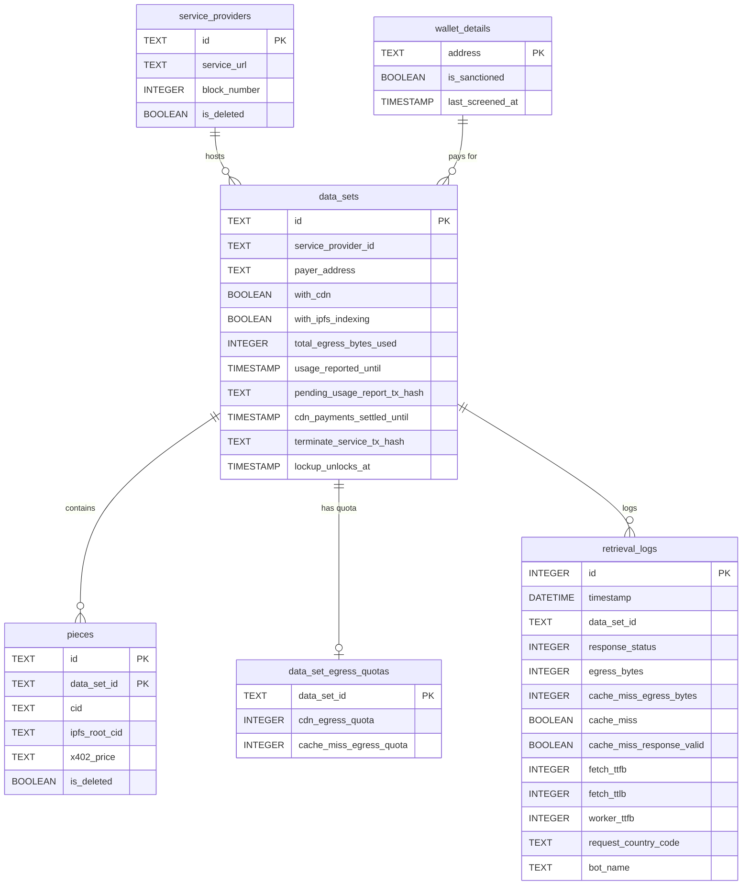

# FilBeam Data Layer

All workers share a **single Cloudflare D1 database** (SQLite). Migrations live in `db/migrations/`.

- **Tests**: migrations are applied automatically via `wrangler d1 migrations apply test-db --local` (see root `package.json` test script).
- **Deploy**: worker deploys (`npm run deploy:calibration/mainnet`) do **not** apply migrations automatically. Run `db/deploy-calibration.sh` / `db/deploy-mainnet.sh` separately before deploying workers when migrations are pending.

---

## Tables

| Table                    | Description                                                                                                               |
| ------------------------ | ------------------------------------------------------------------------------------------------------------------------- |
| `service_providers`      | SP registry: service URL and deletion status, keyed by on-chain provider ID                                               |
| `data_sets`              | CDN deals: links an SP to a payer, tracks CDN/IPFS flags, egress usage, usage reporting watermarks, and termination state |
| `pieces`                 | Pieces per data set: piece CID, IPFS root CID (from chain metadata), and deletion flag                                    |
| `data_set_egress_quotas` | Remaining byte budgets for CDN delivery and cache-miss charges; only exists for data sets that have been topped up        |
| `wallet_details`         | Payer addresses with sanction status and last Chainalysis screen timestamp                                                |
| `retrieval_logs`         | Per-request audit log: egress bytes, cache hit/miss, performance timings, country code, and bot flag                      |

---

## ER Diagram



> Relationships are logical — no foreign-key constraints are declared in the schema.

---

## How Tables Are Populated

### `service_providers`

Written by **indexer** in response to `ServiceProviderRegistry` on-chain events:

| Event                                | Handler                                | Effect                                                                                                    |
| ------------------------------------ | -------------------------------------- | --------------------------------------------------------------------------------------------------------- |
| `ProductAdded` / `ProductUpdated`    | `handleProductAdded/Updated`           | Upserts `id`, `service_url`, `block_number`; skips if stored `block_number` is newer (out-of-order guard) |
| `ProductRemoved` / `ProviderRemoved` | `handleProductRemoved/ProviderRemoved` | Sets `is_deleted = true`                                                                                  |

### `data_sets`

Written by **indexer** in response to `FWSS` and `FilBeamOperator` events:

| Event                     | Handler                             | Effect                                                                                                                                                                                   |
| ------------------------- | ----------------------------------- | ---------------------------------------------------------------------------------------------------------------------------------------------------------------------------------------- |
| `DataSetCreated`          | `handleFWSSDataSetCreated`          | Upserts `id`, `service_provider_id`, `payer_address`, `with_cdn`, `with_ipfs_indexing`; also creates/updates `wallet_details` with sanction screen result **only when `withCDN` is set** |
| `ServiceTerminated`       | `handleFWSSServiceTerminated`       | Sets `with_cdn = false`, calculates and sets `lockup_unlocks_at`                                                                                                                         |
| `CDNPaymentRailsToppedUp` | `handleFWSSCDNPaymentRailsToppedUp` | Increments `data_set_egress_quotas` (idempotent via KV event dedup)                                                                                                                      |
| `CDNPaymentSettled`       | `handleCdnPaymentSettled`           | Advances `cdn_payments_settled_until` to the block timestamp                                                                                                                             |

Written by **usage-reporter** after confirmed on-chain usage report:

- Sets `usage_reported_until` watermark and clears `pending_usage_report_tx_hash`

Written by **terminator** after confirmed termination transaction:

- Sets `terminate_service_tx_hash`

### `pieces`

Written by **indexer** in response to `PDPVerifier` on-chain events:

| Event                     | Handler               | Effect                                                                                                          |
| ------------------------- | --------------------- | --------------------------------------------------------------------------------------------------------------- |
| `PieceAdded` / `addPiece` | `insertDataSetPiece`  | Upserts `id`, `data_set_id`, `cid`, `ipfs_root_cid`, `x402_price`; `ipfs_root_cid` comes from on-chain metadata |
| `PieceRemoved`            | `removeDataSetPieces` | Sets `is_deleted = true` (batch, up to 50 per D1 statement)                                                     |

### `data_set_egress_quotas`

Written by **indexer** (`handleFWSSCDNPaymentRailsToppedUp`): converts top-up amounts to byte quotas using configured rates and increments both `cdn_egress_quota` and `cache_miss_egress_quota`.

Decremented by **piece-retriever** / **ipfs-retriever** after each successful retrieval (only when `ENFORCE_EGRESS_QUOTA` is enabled): `cdn_egress_quota` is charged for all egress bytes served to the client; `cache_miss_egress_quota` is charged only on valid cache misses.

### `wallet_details`

Created/updated by **indexer** on `DataSetCreated`, but **only when `withCDN` is true** (Chainalysis API call per new payer).

Re-screened periodically by **indexer** scheduled task (`screenWallets`): re-screens wallets not checked within the configured stale threshold, ordered oldest-first.

### `retrieval_logs`

Written by **piece-retriever** and **ipfs-retriever** after every request via `recordRetrieval` in `retrieval/lib/stats.js`. Written inside `ctx.waitUntil` so it does not block the response.

---

## Key Queries by Worker

### Retrieval candidate lookup (piece-retriever, ipfs-retriever)

The shared query in `retrieval/lib/access.js` (`buildRetrievalCandidateQuery`) JOINs five tables in one shot:

```sql
SELECT pieces.data_set_id, data_sets.service_provider_id, data_sets.payer_address,
       data_sets.with_cdn, data_set_egress_quotas.cdn_egress_quota,
       data_set_egress_quotas.cache_miss_egress_quota,
       service_providers.service_url, service_providers.is_deleted AS service_provider_is_deleted,
       wallet_details.is_sanctioned
FROM pieces
LEFT OUTER JOIN data_sets ON pieces.data_set_id = data_sets.id
LEFT OUTER JOIN data_set_egress_quotas ON pieces.data_set_id = data_set_egress_quotas.data_set_id
LEFT OUTER JOIN service_providers ON data_sets.service_provider_id = service_providers.id
LEFT OUTER JOIN wallet_details ON data_sets.payer_address = wallet_details.address
WHERE pieces.cid = ?            -- piece-retriever
-- or: pieces.ipfs_root_cid = ?  -- ipfs-retriever
  AND pieces.is_deleted IS FALSE
```

The result rows are then filtered by `filterAuthorizedRetrievalCandidates` (authorization cascade) — see `retrieval/lib/access.js`.

### Slug resolution (ipfs-retriever, slug flow)

Two sequential queries in `ipfs-retriever/lib/store.js`:

1. Resolve `(pieceId, dataSetId)` → `ipfs_root_cid` + `payer_address`:

```sql
SELECT pieces.ipfs_root_cid, data_sets.payer_address
FROM pieces LEFT OUTER JOIN data_sets ON pieces.data_set_id = data_sets.id
WHERE pieces.id = ? AND pieces.data_set_id = ?
```

2. Then the retrieval candidate query above, keyed by `ipfs_root_cid`.

### Usage aggregation (usage-reporter)

Aggregates `retrieval_logs` per data set between the `usage_reported_until` watermark and a target timestamp, excluding bot traffic and data sets with a pending transaction:

```sql
SELECT rl.data_set_id,
       SUM(rl.egress_bytes) AS cdn_bytes,
       SUM(CASE WHEN rl.cache_miss = 1 AND rl.cache_miss_response_valid = 1
                THEN COALESCE(rl.cache_miss_egress_bytes, rl.egress_bytes) ELSE 0 END) AS cache_miss_bytes
FROM retrieval_logs rl
INNER JOIN data_sets ds ON rl.data_set_id = ds.id
WHERE rl.timestamp > datetime(ds.usage_reported_until)
  AND rl.timestamp <= datetime(?)
  AND rl.egress_bytes IS NOT NULL
  AND rl.bot_name IS NULL
  AND ds.pending_usage_report_tx_hash IS NULL
GROUP BY rl.data_set_id
HAVING (cdn_bytes > 0 OR cache_miss_bytes > 0)
```

### Terminator

Finds active CDN data sets whose payer is sanctioned and have no pending termination:

```sql
SELECT DISTINCT data_sets.id
FROM data_sets
LEFT JOIN wallet_details ON data_sets.payer_address = wallet_details.address
WHERE data_sets.with_cdn = 1
  AND wallet_details.is_sanctioned = 1
  AND data_sets.terminate_service_tx_hash IS NULL
```

### Payment settler

Finds data sets that need CDN payment rail settlement (active, recently reporting, not sanctioned):

```sql
SELECT data_sets.id
FROM data_sets
LEFT JOIN wallet_details ON data_sets.payer_address = wallet_details.address
WHERE (data_sets.with_cdn = 1 OR data_sets.lockup_unlocks_at >= datetime('now'))
  AND data_sets.terminate_service_tx_hash IS NULL
  AND data_sets.usage_reported_until >= datetime('now', '-30 days')
  AND (wallet_details.is_sanctioned IS NULL OR wallet_details.is_sanctioned = 0)
```

### Stats API

- **Per data set** (`stats-api`): reads `data_set_egress_quotas` by `data_set_id`
- **Per payer** (`stats-api`): aggregates `data_set_egress_quotas` and `retrieval_logs` joined through `data_sets`, grouped by `payer_address`
