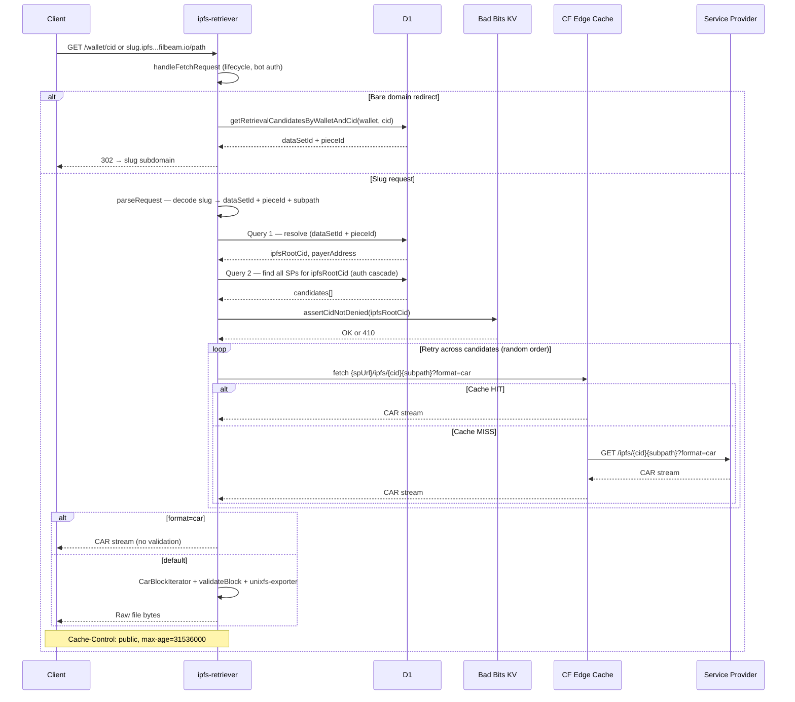

# ipfs-retriever

## Overview

`ipfs-retriever` is a Cloudflare Worker that serves IPFS content stored by Filecoin service providers (SPs). It receives a request identifying a specific dataset and piece, fetches the corresponding CAR archive from an SP, validates every block, and streams the raw file bytes to the client.

It depends on the shared `@filbeam/retrieval` library for authorization, candidate selection, egress quota tracking, and the fetch lifecycle.

---

## URL formats

There are two entry points:

### Slug subdomain (primary)

```
https://1-{base32(dataSetId)}-{base32(pieceId)}.ipfs.calibration.filbeam.io/{subpath}
```

The slug encodes both the on-chain `dataSetId` and `pieceId` as base32 bigints, prefixed with a version (`1`). Parsed in `ipfs-retriever/lib/request.js`.

Examples:

- `https://1-abc123-def456.ipfs.calibration.filbeam.io/` — root of the piece
- `https://1-abc123-def456.ipfs.calibration.filbeam.io/path/to/file.jpg` — specific file

#### Why the IPFS CID is not in the slug

The slug does not include the `ipfsRootCid`. The CID is looked up from D1 at request time: when an SP registers a piece on-chain via `addPiece`, it attaches `ipfsRootCID` as a metadata key. The indexer picks this up from the Goldsky webhook event and stores it in the `pieces` table keyed by `(dataSetId, pieceId)`. At retrieval time, the worker decodes the slug to get `dataSetId + pieceId`, queries D1 for the associated `ipfsRootCid`, and uses that CID to both find the right SP and construct the fetch URL. Encoding the CID in the slug itself would push the DNS label past the 63-character limit, and is unnecessary since the indexer already has it.

ref.: [FIlBeam URL Format Doc](https://space-meridian.github.io/docs/Engineering/fefc0d538c414c8e96a56587e4ca75ce/FilBeam/FilBeam%20URL%20format%2027ecdd5cccdb806caeeaefad80cbf64d.html#27ecdd5c-ccdb-800e-ac46-de8a4a64f0a8)

#### Why CID + wallet address can't both be in the subdomain

The initial design proposed combining the IPFS CID and wallet address into a single subdomain component (e.g. `bafk123-0xabc.filbeam.io`). This was ruled out because a single DNS label is limited to 63 characters, too short to fit both a base58 CID and a 42-character Ethereum address together. (see [follow-up comment, issue #297](https://github.com/filbeam/worker/issues/297#issuecomment-3352714474))

#### Why the wallet address is not in the slug at all

The wallet address is not needed in the slug because `dataSetId` alone is sufficient to look it up in D1. Omitting it keeps the subdomain short enough to be valid. The worker resolves the wallet from the dataset record at query time. (see [review comment, PR #312](https://github.com/filbeam/worker/pull/312#issuecomment-4797500253))

#### Why identifiers are in the subdomain

Static websites served over IPFS often load sub-resources at absolute paths (e.g. `<link href="/style.css">`). For these paths to resolve correctly, the dataset/piece identity must live in the subdomain, not the URL path, so that `/style.css` naturally maps to the right SP origin without any path rewriting. (see [original proposal comment, issue #297](https://github.com/filbeam/worker/issues/297#issuecomment-3346046091))

### Bare domain redirect (convenience)

```
https://ipfs.calibration.filbeam.io/{walletAddress}/{ipfsRootCid}/{subpath}
```

Handled by `handleDnsRootRequest` in `ipfs-retriever/bin/ipfs-retriever.js`. Validates that `walletAddress` has an authorized deal for `ipfsRootCid` (running the full authorization cascade: payment rail, CDN flag, sanctions check), looks up the corresponding `dataSetId + pieceId` in D1, builds the slug, and issues a 302 redirect to the slug subdomain URL. If the wallet is not associated with that CID, the request is rejected with 402 before any redirect occurs. This validation is based entirely on indexed on-chain metadata — FilBeam does not verify that the `ipfsRootCid` actually corresponds to the piece data stored by the SP. Useful for constructing shareable links without knowing the on-chain IDs upfront.

If the request is to the bare domain with no wallet or CID (i.e. `https://ipfs.calibration.filbeam.io/`), redirects to `https://filbeam.com`.

### Query parameters

- `?format=car` — serve the raw CAR archive to the client without conversion or block validation. The worker proxies the SP response as-is. Per the [IPFS Trustless Gateway spec](https://specs.ipfs.tech/http-gateways/trustless-gateway/), CAR is a client-validated transport, the caller is responsible for verifying block integrity.
- `?format=raw` — not yet implemented (returns 400); tracked in [issue #295](https://github.com/filbeam/worker/issues/295)
- No `?format` — default; converts CAR to raw file bytes. The worker validates every block before streaming. Each block's bytes are hashed and compared to its CID multihash via `validateBlock()`. The client receives only bytes that have passed verification.

---

## Request flow

There are two entry points — the bare domain redirect and the slug flow — both handled by the same worker.



### Step-by-step

**① `handleFetchRequest` (shared lifecycle)**

Sets up per-request context, registers an abort listener, rejects non-GET/HEAD with 405, redirects legacy `*.filcdn.io` domains to `*.filbeam.io` with 301, and runs `checkBotAuthorization` to validate the `Authorization` header against `BOT_TOKENS`. All errors thrown from here on are caught and converted to HTTP responses via `handleError`.

**② Route detection**

If the hostname matches the bare `DNS_ROOT` (e.g. `ipfs.calibration.filbeam.io`), the request is handled by `handleDnsRootRequest`: extracts `walletAddress` and `ipfsRootCid` from the URL path, runs the full authorization cascade to verify the wallet has a deal for that CID, looks up `dataSetId + pieceId` from D1, and issues a **302 redirect** to the slug subdomain. No content is served from this path.

For slug requests, `parseRequest` strips the `DNS_ROOT` suffix from the hostname, splits the slug into `[version, encodedDataSetId, encodedPieceId]`, decodes each with `base32ToBigInt`, and extracts `ipfsSubpath` from `url.pathname` and `ipfsFormat` from `?format=`.

**③ `getRetrievalCandidatesByDataSetAndPiece`**

Two D1 queries:

1. Resolve `(dataSetId + pieceId)` → `ipfsRootCid + payerAddress`. Throws 404 if the piece doesn't exist, has no payer, or has no `ipfsRootCid`.
2. Query all rows matching `pieces.ipfs_root_cid = ?` joined across `data_sets`, `service_providers`, `data_set_egress_quotas`, and `wallet_details`. Runs the authorization cascade over the results:

| Check | Error if all rows fail |
|-------|------------------------|
| Any rows at all | 404 — not indexed |
| SP exists and is not deleted | 404 — no SP |
| `payer_address` matches wallet | 402 — no deal for this payer |
| `with_cdn = 1` | 402 — CDN disabled |
| `is_sanctioned` is false | 403 — payer is sanctioned |
| `service_url` is set | 404 — SP not approved |
| `with_ipfs_indexing = 1` | 402 — IPFS indexing disabled |
| `ipfs_root_cid` is set | 404 — no CID on piece |
| (if `enforceEgressQuota`) quota > 0 | 402 — quota exhausted |

Returns one candidate per authorized SP: `{ serviceUrl, serviceProviderId, dataSetId, pieceId, ipfsRootCid }`. Multiple candidates exist when the same dataset is served by more than one SP — the worker retries across them if one fails.

**④ `assertCidNotDenied`**

Checks `ipfsRootCid` against the Bad Bits denylist stored in KV. Returns 410 if blocked.

**⑤ `selectRetrievalCandidate`**

Shuffles candidates randomly (no fixed priority) and tries them one by one. A candidate is skipped if its retrieval throws or returns a 5xx. If all candidates fail, logs the failure and returns 502 listing all attempted SPs.

**⑥ `retrieveIpfsContent`**

Fetches `{serviceUrl}/ipfs/{ipfsRootCid}{subpath}?format=car` with Cloudflare cache options (`cacheEverything: true`, TTL 86400 for 2xx, 0 for 4xx/5xx). Reads `CF-Cache-Status`: anything other than `HIT` is a cache miss and drives egress quota billing.

**⑦ `processIpfsResponse`**

- **`?format=car`**: body passed through as-is, no validation (client's responsibility per the Trustless Gateway spec).
- **Default**: wraps the body in a counting generator (`countingBody`) to track SP egress bytes, then runs the full streaming pipeline — `CarBlockIterator`, per-block multihash check, `validateBlock`, and `ipfs-unixfs-exporter` traversal. A directory entry returns 404. A file or raw entry's `entry.content()` is converted to a `ReadableStream` and returned.

**⑧ `serveRetrievalOutcome`**

Pipes the response body through a `TransformStream` that counts `egressBytes` chunk by chunk, preserving backpressure — the SP is pulled only as fast as the client reads. Once the stream ends, `ctx.waitUntil` runs `recordRetrieval` to log the result to D1. Sets `Cache-Control: public, max-age=31536000` and `X-Data-Set-ID` on the response.

---

## CAR streaming pipeline

The core of the worker is a fully lazy, end-to-end streaming pipeline. Nothing is buffered in memory. The only allocation at any point is one block at a time.

```
SP (frisbii/Curio)
  └─ CAR stream (HTTP response body, streaming)
       └─ countingBody — async generator counting SP egress bytes
            └─ CarBlockIterator.fromIterable() — parses CAR header upfront, yields blocks lazily
                 └─ blockstore.get(cid) — called by the exporter per block
                      ├─ blocksReader.next() — pulls next block from the CAR stream
                      ├─ multihash comparison — verifies the block CID matches what the exporter asked for
                      └─ validateBlock() — hashes the bytes, confirms they match the multihash
                           └─ ipfs-unixfs-exporter (recursive())
                                └─ entry.content() — yields leaf block bytes
                                     └─ ReadableStream → HTTP response to client
```

### Why `blockReadConcurrency: 1`

The exporter is called with `{ blockReadConcurrency: 1 }`. This forces it to request blocks strictly one at a time in DFS traversal order. The blockstore's `get(cid)` does not look blocks up by CID, it calls `blocksReader.next()` and expects that the next block in the CAR is always the one being requested. This works because the SP guarantees DFS-ordered delivery (see [SP integration contract](#sp-integration-contract)). If `blockReadConcurrency` were greater than 1, the exporter would request blocks in parallel and the sequential CAR reader would return the wrong block for each.

### `CarBlockIterator` vs `CarReader`

`CarBlockIterator.fromIterable` reads only the CAR header (roots + version) upfront. Block data is pulled lazily as the iterator is consumed.

### CAR-to-raw conversion

`processIpfsResponse` uses the `recursive` export from `ipfs-unixfs-exporter` aliased as `exporter`. Despite the name, it is used here only to resolve the first entry (the requested path) and stream its bytes, the loop exits after the first iteration intentionally (`// eslint-disable-next-line no-unreachable-loop`). The actual `exporter()` function would be semantically cleaner for this use case.

When converting CAR to raw:

- `content-disposition: inline` is set so browsers display the content instead of downloading it
- `content-type` and `x-content-type-options` are removed so the browser sniffs the raw bytes

### Directory entries

If the resolved path is a UnixFS directory, the worker returns **404 Not Found** (`retrieval.js:195`). Directory listing is not implemented. Since the SP returns a path-scoped CAR with `dag-scope=all`, the directory block and immediate child blocks are present in the CAR. The 404 is a choice, not an architectural limit. This is tracked in [issue #696](https://github.com/filbeam/worker/issues/696).

---

## SP integration contract

The pipeline makes specific assumptions about how the SP delivers the CAR. These are satisfied by **Curio**, which implements the [frisbii](https://github.com/ipld/frisbii) trustless HTTP gateway:

1. **Path-scoped CAR** — the SP is called as `GET /ipfs/{rootCid}{subpath}?format=car`. It returns a CAR containing exactly the blocks needed to walk from `rootCid` to `subpath` and read the file. No more, no less. There are no wasted bytes for single-asset requests regardless of dataset size.

2. **DFS-ordered blocks** — blocks are written to the CAR in the same order the DAG traversal engine requests them (depth-first). This is enforced in frisbii via `carPipe`, which hooks into the IPLD link system and writes each block to the CAR immediately as it is loaded during traversal. This is what makes the sequential `blocksReader.next()` blockstore safe.

3. **Complete or fail loudly** — if any block is missing from SP storage, the traversal fails before any bytes are written to the CAR. The SP returns an HTTP error, not a partial CAR. The worker either gets a complete, valid CAR or an error response, never a silently truncated one.

**If a non-frisbii SP is ever onboarded**, all three guarantees must be verified before integration (tracked in [issue #692](https://github.com/filbeam/worker/issues/692)). The CID mismatch error (`Unexpected block CID`) is the failure mode if ordering is violated, it is not obvious without this context.

### Trust model

FilBeam trusts the `ipfsRootCid` submitted by the SP as on-chain metadata at `addPiece` time. It is indexed as-is without verifying it corresponds to the actual piece data stored on Filecoin. An SP could submit any CID as metadata.

The only integrity guarantee FilBeam provides is at the block level: `validateBlock()` hashes each block's bytes and confirms they match the block's CID. This proves the CAR is self-consistent. It does not prove the CAR represents the content of the underlying Filecoin piece, since both the CID claim and the CAR bytes originate from the same SP.

### Alternative: block-by-block retrieval (Discarded)

An alternative design (used by IPFS Shipyard tooling like Boxo and verified-fetch) drives the exporter with a blockstore whose `get(cid)` makes individual HTTP requests: `GET /ipfs/{blockCid}?format=raw`. This eliminates the ordering dependency and enables per-block Cloudflare caching.

The trade-off: a single file goes from 1 SP fetch to potentially 20–80 individual fetches. For FilBeam, which controls both ends and knows all blocks are at the same SP, the CAR approach is currently a good solution, one round-trip, any file size, fully streaming. The block-by-block design exists to solve distributed-network problems (blocks scattered across unknown peers) that FilBeam does not have.

[Slack discussion Reference](https://filecoinproject.slack.com/archives/C08TVNKJV7C/p1779163683412569?thread_ts=1778671570.686079&cid=C08TVNKJV7C)

---

## Caching

There are two independent cache layers.

### Layer 1 — Cloudflare edge cache (origin fetch)

Configured via the `cf` option on the SP `fetch` call (`retrieval/lib/origin-cache.js`):

```js
{
  cacheEverything: true,
  cacheTtlByStatus: { '200-299': ORIGIN_CACHE_TTL, 404: 0, '500-599': 0 }
}
```

- `cacheEverything: true` — caches the SP response regardless of its `Cache-Control` header
- 2xx responses are cached for `ORIGIN_CACHE_TTL` seconds (currently **86400, 1 day**)
- 404 and 5xx responses are never cached

**Cache key:** `{spBaseUrl}/ipfs/{ipfsRootCid}{ipfsSubpath}?format=car`

Since CIDs are content-addressed and immutable, the same key always resolves to the same bytes. `ORIGIN_CACHE_TTL` could theoretically be much longer, but a very large TTL risks filling PoP cache storage with large CARs. The current 1-day value is a reasonable starting point and should be revisited once cache hit rates and storage pressure are measurable.

**Cache miss detection:** after the fetch, `CF-Cache-Status: HIT` means the edge served a cached copy; anything else is treated as a cache miss. Cache misses are what drive egress quota billing.

### Layer 2 — Client/browser cache

Set on every successful response to the client (`retrieval/lib/fetch-handler.js`):

```
Cache-Control: public, max-age=31536000
```

1 year. CID-addressed content is immutable, so this is correct.

### Where cache data is stored

Both layers use Cloudflare's edge network. Data is cached at the **PoP (Point of Presence)** that handled the request, whichever of Cloudflare's ~300 global data centers is geographically closest to the client. Each PoP maintains its own independent cache. A cache hit in Los Angeles does not warm the Frankfurt PoP. Enabling **Cloudflare Tiered Cache** at the account level would add a regional upper-tier cache, reducing cold-PoP fetches from Storage Providers for popular content if this becomes necessary in the future (it's not needed today).

### Cache hit cost

On a cache hit, the SP round-trip is eliminated but the worker still receives the full CAR body and runs the complete pipeline (CAR parsing, block validation, unixfs traversal). The cache saves network bytes from the SP but not CPU work in the worker.

---

## Related

- `retrieval/` — shared library providing `handleFetchRequest`, `selectRetrievalCandidate`, `assertCidNotDenied`, egress quota tracking, and authorization
